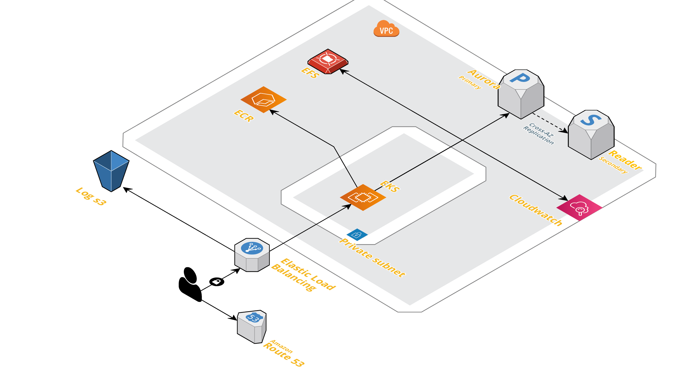
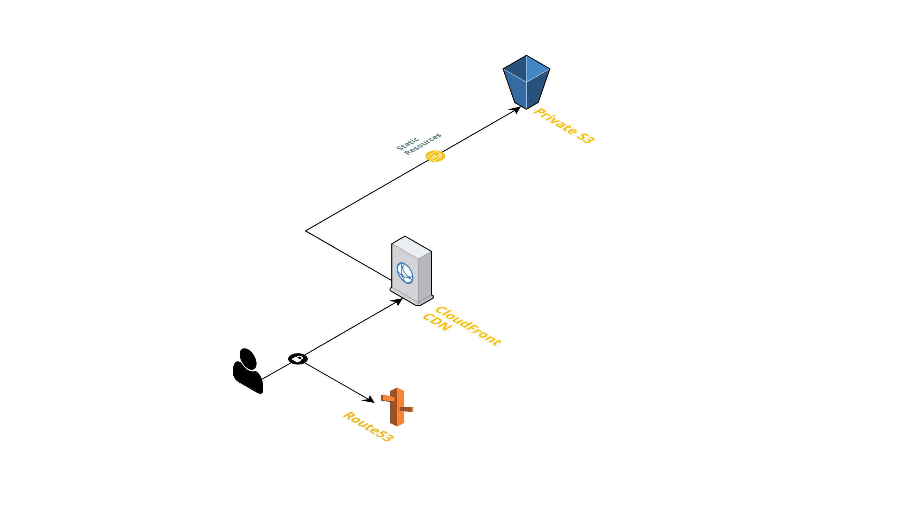

# interviews

These are interview scenarios. Please pick of the scenarios and then submit them to the HR contact.

Do not hesitate to reach out to the HR contact if you have any questions.

1. Docker-Kubernetes

1.1 Optimise Dockerfile for caching benefits.

- Put the mod download layer on top so any codes changes will not overwrite the package download layer

- remove the git install, we seems to no need it.

- disable cgo and set build target to linux

  1.2 Convert the current Dockerfile into a multistage build Dockerfile.

Use distroless as minimal base image to package binary

1.3 Write a simple Kubernetes manifest that could be used to deploy the image to a Kubernetes cluster.

- add hpa to ensure app can scale out

- add liveness to ensure handle app faults

2. backend-app-deploy



- consider security implications of running the website; the most minimal surface area is preferred
  - EKS should be inside private network with NAT internet gateway
  - The ingress should be only via elb in front
  - elb enable http to https
- the website solution ideally should be as fast as possible
  - better use deployment + hpa ( similar to Docker-Kubernetes one)
- the solution should be cost effective
  - s3 should have lifecyle
  - cloudwatch logs should have retention
  - long term logs should persist s3
- in development, there might be two or three people working on 'features'
  - if possible should service mesh with label
  - eg istio, then use the destination rule to map the traffic to different feature deployment accordingly
- the website should be monitored from a third party location

  - aws resource eg RDS can use cloudwatch alarms - K8s infra can use promethus stack - Can use lamdba function to build log alarms on the logs ( eg check the log level if error or fatal alarm dev channels )
  - Website should have healthcheck endpoint which be monitoring by another status server that can send alarm to pageduty

CI: similar to the Docker-Kubernetes

- build docker image and push to ECR
- run the db migration
- deploy k8s resource to EKS
- get status of the deployment
- notify CI/CD results

3. browser-app-deploy



- consider security implications of running the website; the most minimal surface area is preferred
  - the s3 should be private and only open to cloudfront and CI node
  - cloudfront enable http to https
- the website solution ideally should be as fast as possible
  - use the cache optimized and enable gzip in cloudfront
  - index.html should be set to no cache in cache behavior
- the solution should be cost effective
- in development, there might be two or three people working on 'features'
  - frontend one can not achieve similar function as service side
  - but they can always test locally
- the website should be monitored from a third party location
  - enable google analysis or similar js side monitoring
  - or use new replic tracing lib or similar tracing tools to trace from frontend to backend.

CI: should be multiple stage

- use node build to build the static files
- use aws cli to deploy
- it is possible to package the aws cli and dist as image and push to ECR, then use k8s job to deploy to the s3 which using EKS RBAC limit access certain service account

4. fix the cloudformation stack

PS: It seems that this EC2 is used to run a job, if with k8s we can just use the job to run those once time stuff.

- there are concerns with the cost of the infrastructure
  - no need z1d mysql client will not need that much cpu
- there appears to be issues with environmental portability
  - use parameter to select the right resource accordingly
- there appears to be issues with resiliency
  - better send the logs via cloudwatch agent

```
aws cloudformation create-stack \
--stack-name myteststack \
--template-body file://fix-cloudformation-stack/template.json \
--parameters ParameterKey=SecurityGroup,ParameterValue=sg-12343223

# better delete the stack if job succeed
aws cloudformation delete-stack \
--stack-name myteststack
```
